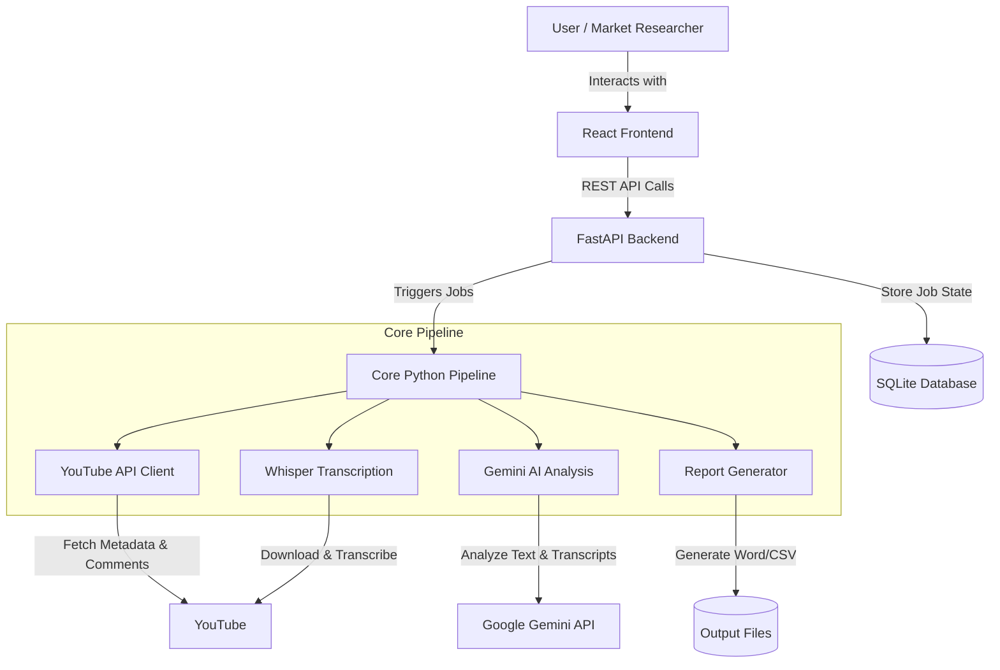

# YouTube Video Intelligence Pipeline - Architecture & Goals

## 🎯 Project Goal
The **YouTube Video Intelligence Pipeline** is a comprehensive toolkit designed for **Automotive Market Research**. Its primary goal is to automate the extraction of insights from YouTube car review videos and user comments. 

By leveraging the YouTube Data API, audio transcription (Whisper), and Large Language Models (Google Gemini), the system analyzes public sentiment, identifies key strengths and weaknesses of specific car models, and generates comprehensive reports (Word/Excel/CSV) and user personas based on real-world feedback.

---

## 🏗️ High-Level Architecture
The project is structured into three main logical components:

1. **Core Analysis Pipeline (`src/`)**: The Python-based engine that handles data extraction, transcription, AI analysis, and report generation.
2. **Backend API (`backend/`)**: A FastAPI server that wraps the core pipeline into asynchronous jobs, exposing REST endpoints and managing job history via a SQLite database.
3. **Frontend Web App (`frontend/`)**: A React-based user interface that allows users to trigger new analyses, view real-time progress, and explore generated insights through dashboards.

---

## ⚙️ Component Breakdown

### 1. Core Pipeline (`src/`)
The core pipeline (`src/pipeline.py`) orchestrates a multi-stage process:
* **Video Discovery (`youtube_api.py`)**: Uses the YouTube Data API to search for relevant videos based on predefined or custom car models and search queries.
* **Comment Collection (`youtube_api.py`)**: Fetches top-level comments and replies for the discovered videos to gather public sentiment.
* **Audio Transcription (`transcription.py`)**: Uses `yt-dlp` to download video audio and `OpenAI Whisper` (via HuggingFace Transformers/PyTorch) to transcribe the audio into text.
* **AI Analysis (`analysis.py`)**: Sends the video transcripts and aggregated comments to **Google Gemini**. It prompts the LLM to extract sentiment (Positive/Negative/Neutral), key strengths, weaknesses, and generate user personas.
* **Report Generation (`reports.py`)**: Compiles the AI analysis and raw data into structured formats like Word documents (`python-docx`), Excel spreadsheets, and CSV files.

### 2. Backend API (`backend/app.py`)
* **Framework**: FastAPI
* **Database**: SQLite (`history.db`)
* **Role**: Provides a RESTful interface for the frontend. It manages long-running analysis tasks using FastAPI's `BackgroundTasks`.
* **State Management**: Tracks job status (e.g., videos found, transcribed, analyzed) and stores the final structured results in the database for quick retrieval by the frontend.

### 3. Frontend Web App (`frontend/`)
* **Framework**: React 18 with TypeScript, built with Vite.
* **Styling**: Tailwind CSS.
* **Role**: Provides a user-friendly dashboard to:
  * Start new analyses (selecting predefined models like Renault Scenic, Tesla Model 3, or custom queries).
  * Monitor real-time job progress.
  * View historical analysis jobs.
  * Visualize sentiment distribution (e.g., pie charts) and read detailed video-by-video breakdowns.

---

## 🔄 Data Flow

1. **Initiation**: The user submits a request via the React Frontend (or CLI `main.py`) specifying a car model (e.g., "Renault Scenic E-Tech").
2. **Job Creation**: The FastAPI backend creates a new job record in SQLite and starts a background task.
3. **Discovery**: The pipeline queries YouTube for videos matching the car model and downloads their metadata and comments.
4. **Processing**: 
   * Audio is downloaded to the `downloads/` folder.
   * Audio is transcribed to text.
5. **AI Inference**: Transcripts and comments are batched and sent to the Google Gemini API for structured analysis.
6. **Aggregation**: Results are saved to the `output/` directory as CSV and Word reports. The backend database is updated with the final JSON-like structured data.
7. **Presentation**: The frontend polls the backend, retrieves the completed data, and renders charts and data tables for the user.

---

## 🛠️ Technology Stack

| Category | Technologies Used |
| :--- | :--- |
| **Language** | Python 3.9+, TypeScript, Node.js 18+ |
| **Frontend** | React, Vite, Tailwind CSS |
| **Backend** | FastAPI, Uvicorn, SQLite |
| **AI / ML** | Google Generative AI (Gemini), OpenAI Whisper (`transformers`, `torch`) |
| **Data Extraction** | Google API Python Client (YouTube Data API v3), `yt-dlp` |
| **Data Processing** | Pandas |
| **Document Generation**| `python-docx` |
